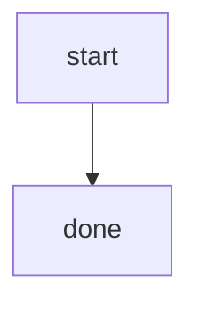

# Mermaid gotchas that break Go diagrams

These are the failures that show up most often when agents invent diagrams from
memory. The templates under `assets/templates/` already avoid all of them.

## Reserved node IDs

In a flowchart, `end` is a keyword that closes subgraphs. This does **not** parse:

```mermaid
flowchart TD
  start --> end
```

Use `done`, `finish`, or `exit` instead:



Also avoid as IDs: `graph`, `subgraph`, `class`, `style`, `click`, `link`, `state`,
`o`, `x`.

## Unquoted special characters

Parentheses, commas, colons, slashes, braces and quotes inside a label must be
quoted:

```mermaid
flowchart TD
  bad[Handler (HTTP)]
  good["Handler (HTTP)"]
```

## Wrong diagram keyword

| Wrong | Right |
| --- | --- |
| `stateDiagram` | `stateDiagram-v2` |
| `graph TD` | `flowchart TD` |
| no type line at all | first non-comment line is the type |

## Arrow family mismatch

- Flowcharts: `-->`, `---`, `-.->`, `==>`, `-- text -->`
- Sequence diagrams: `->>`, `-->>`, `-)`, `--)`
- Class diagrams: `<|--`, `*--`, `o--`, `..|>`, `-->`

Mixing families is a parse error.

## Unbalanced blocks

Every opener needs a matching `end` on its own line:

- `subgraph ...` / `end`
- `alt` / `else` / `end`
- `opt` / `end`
- `loop` / `end`
- `par` / `and` / `end`
- `critical` / `option` / `end`
- nested `state Name { ... }` (self-closing with `}`)

## Sequence activation imbalance

`activate X` and `deactivate X` must pair. Prefer putting deactivations **outside**
`alt`/`opt` blocks so every branch shares the same teardown, the way
`request-lifecycle.mmd` does.

## Comments

`%%` comments belong on their own line. A trailing `%% note` on a statement line is
parsed as content and often breaks the statement.

## Line breaks

Use `<br/>` (self-closing) inside labels. Bare `<br>` is unreliable across renderers.

## One fence, one diagram

Do not put two diagram type declarations in one fence. Split them.

## Lint before you commit

```bash
node scripts/mermaid-lint.mjs docs/architecture.md
node scripts/mermaid-lint.mjs --deep docs/architecture.md   # needs mmdc on PATH
```
